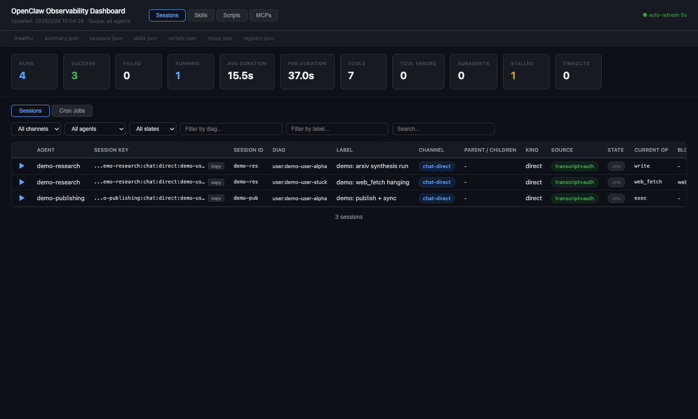
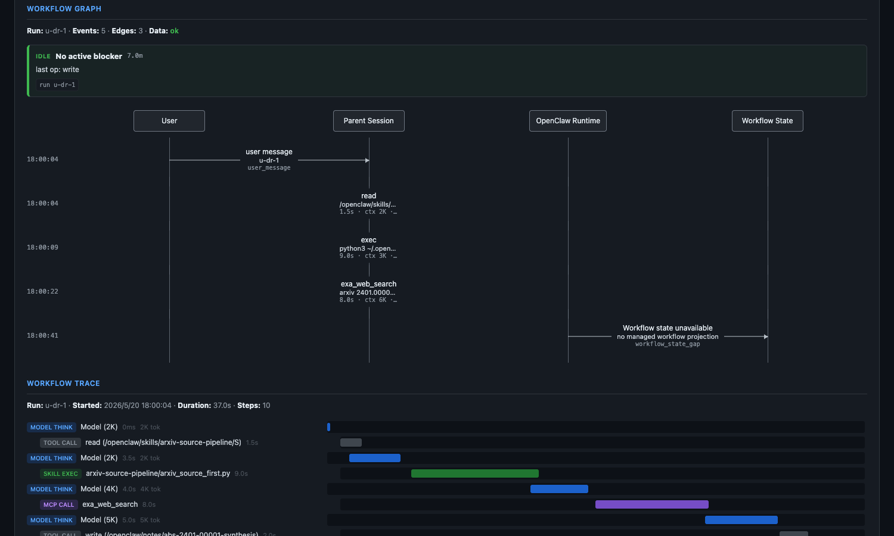
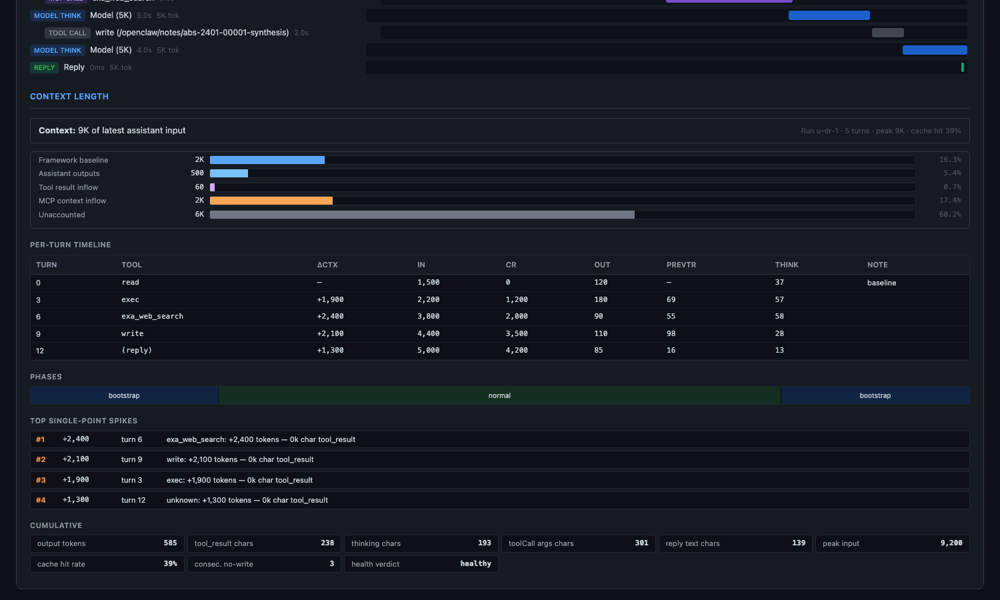
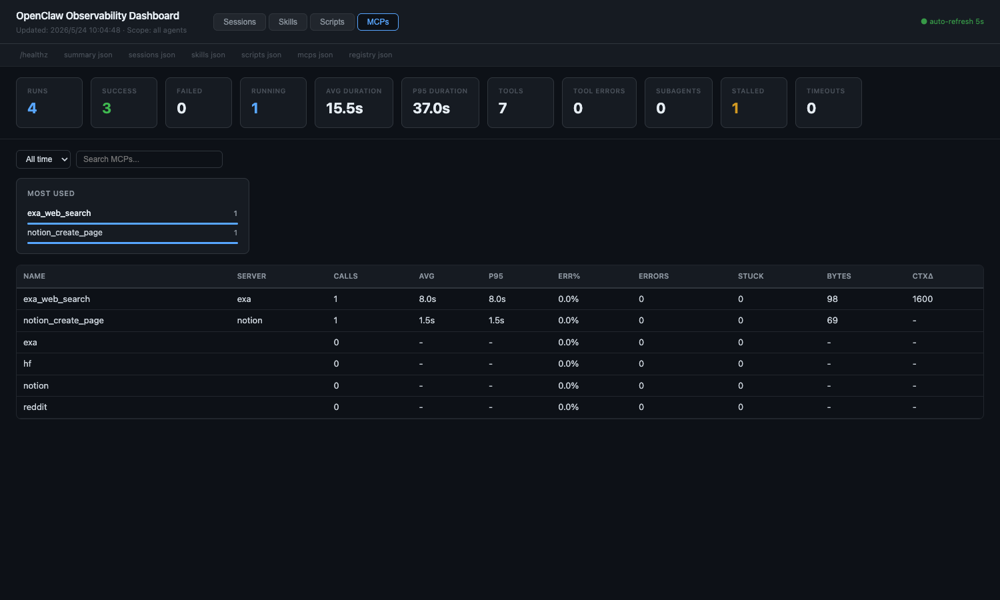

# OpenClaw Observability

[](https://github.com/houyili/openclaw-observability/actions/workflows/ci.yml)
[](LICENSE)
[](https://nodejs.org/)
[](https://github.com/houyili/openclaw-observability/releases)

OpenClaw Observability is a self-hosted dashboard for transcript-based
agent monitoring. It reads OpenClaw session JSONL files plus
`openclaw sessions --json`, persists the derived state in SQLite, and
serves a local web UI for session health, token usage, execution traces,
context-length analysis, and deterministic workflow graphs.

It is intentionally small: no npm dependencies, no build step, no hosted
backend, and no LLM summarization in the observability path.

## What It Shows

- Fleet summary: active sessions, token totals, current operations, stuck
  steps, recent errors, and registry statistics.
- Sessions table: one row per `(session_key, session_id)` with parent-child
  lineage, channel, model, token source, and diagnostic state.
- Workflow Graph: deterministic swimlane projection across user, parent
  session, OpenClaw runtime, child sessions, and optional workflow state.
- Prompt Check: deterministic workflow-rule projection that links transcript
  evidence and optional hook reminder events to actionable diagnostics.
- Workflow Trace: per-run waterfall from transcript steps.
- Context Length: coarse bucket breakdown and per-turn timeline derived
  from assistant `usage` fields.
- CLI bridge: `/observ <subcommand>` handlers backed by the same SQLite
  store, suitable for chat-channel integrations.

## Screenshots


*Fleet summary with token totals, active sessions, recent errors, and the Sessions table with per-row activity sparkline.*


*Deterministic Workflow Graph: User / Parent Session / OpenClaw Runtime / Child Session / Workflow State swimlanes with full provenance on every event.*


*Per-turn Context Length view: coarse 5-bucket breakdown, per-turn timeline, phase auto-detection, and death-loop heuristics.*


*Tab 4 lists every installed MCP, including ones with zero calls (constitution §4.3.1).*

## Requirements

| Requirement | Version / notes |
| --- | --- |
| Node.js | 22 or newer, for `node:sqlite` and TypeScript stripping |
| OpenClaw CLI | available on `PATH` as `openclaw` |
| OS | macOS primary path; Linux supported for manual/systemd startup |

The dashboard uses only Node standard-library modules.

## Quick Start

```bash
git clone https://github.com/houyili/openclaw-observability.git \
  ~/.openclaw/extensions/observability-v2
cd ~/.openclaw/extensions/observability-v2

./scripts/install.sh
```

Open [http://127.0.0.1:18902](http://127.0.0.1:18902).

The installer checks Node.js, the OpenClaw CLI, local config, and the
user-level service. It explains every permission-sensitive action before it
runs it. For a preview:

```bash
./scripts/install.sh --dry-run
```

Foreground mode is still available:

```bash
cp .env.example .env
npm run start
```

Uninstall and upgrade:

```bash
./scripts/upgrade.sh
./scripts/uninstall.sh
./scripts/doctor.sh
```

## Configuration

Copy `.env.example` to `.env`. Values may be unquoted or quoted.

| Key | Purpose |
| --- | --- |
| `OBS_AUTH_TOKEN` | Optional bearer token for non-local API requests |
| `OBS_ALLOW_UNAUTH_TUNNEL` | Defaults to `0`; set to `1` only for a temporary unauthenticated tunnel demo |
| `OBS_NGROK_DOMAIN` | Optional fixed ngrok domain for `scripts/tunnel-ngrok.sh` |
| `OBS_FIXED_URL` | Optional public URL hint for external integrations |

When `OBS_AUTH_TOKEN` is set, non-local `/api/*` requests should use
`Authorization: Bearer <token>`. Browser sharing URLs should use
`#token=...`; query-string tokens remain accepted for compatibility but are
not recommended for shared tunnel URLs. Localhost, static assets, and
`/healthz` remain accessible.

Tunnel scripts refuse to expose a public URL unless `OBS_AUTH_TOKEN` is set,
unless you explicitly opt into `OBS_ALLOW_UNAUTH_TUNNEL=1`. Generated sharing
URLs use `#token=...` so the token stays in the browser fragment.

Operational constants such as the port, poll cadence, and stuck threshold
live in `src/config.ts`.

## Tests

```bash
npm run test:hermetic
npm run test:open-source-sanitization
npm run test:integrity
npm run test:live-e2e
npm run test:replay
npm run test:cross-check -- --retry-wait 0
npm run test:perf
```

`test:hermetic` is the clean-clone suite used by CI. The live suites read
the local OpenClaw install and live transcripts.

## Data And Security

Observability data stays local by default:

- SQLite DB: `~/.openclaw/logs/observability-v2/obs.db`
- Transcript source: `~/.openclaw/agents/<agent>/sessions/*.jsonl`
- Local HTTP: `127.0.0.1:18902`

Do not commit `.env`, generated `.plist` files, logs, DB files, browser
state, or OpenClaw runtime state. See [`DATA_ACCESS.md`](DATA_ACCESS.md)
and [`docs/security.md`](docs/security.md).

## Public API

```bash
curl http://127.0.0.1:18902/healthz
curl http://127.0.0.1:18902/api/summary
curl http://127.0.0.1:18902/api/sessions
curl http://127.0.0.1:18902/api/sessions/ENCODED_KEY/prompt-check
curl http://127.0.0.1:18902/api/sessions/ENCODED_KEY/workflow
curl http://127.0.0.1:18902/api/sessions/ENCODED_KEY/trace
curl http://127.0.0.1:18902/api/sessions/ENCODED_KEY/context
```

The workflow endpoint returns `{ lanes, events, edges, diagnostics, runs }`.
Every workflow event includes provenance such as `step_id`, `run_id`,
`childSessionKey`, `flow_id`, or `artifact_path` when available.

## Design Notes

- Transcript JSONL is the source of execution truth.
- `openclaw sessions --json` is authoritative for live session inventory
  and official nonzero token totals.
- If official token totals are zero but transcript usage is available,
  the API marks the row as `tokenSource: "transcript-backfill"`.
- Sidecar transcript files such as `.acp-stream`, `.checkpoint.*.jsonl`,
  and `.trajectory.jsonl` are skipped.
- Workflow Graph labels are deterministic. Optional managed workflow
  adapters may add child-binding diagnostics, but no LLM-generated summary
  is used to create graph edges.
- Prompt Check rules are generic OpenClaw workflow checks loaded from
  `config/prompt-rules.json`. They do not depend on a private agent or
  workspace prompt.

More detail:

- [`docs/user-manual.md`](docs/user-manual.md)
- [`docs/architecture.md`](docs/architecture.md)
- [`docs/workflow-graph.md`](docs/workflow-graph.md)
- [`docs/prompt-check.md`](docs/prompt-check.md)
- [`docs/install/macos.md`](docs/install/macos.md)
- [`docs/install/linux.md`](docs/install/linux.md)
- [`docs/install/cloudflare.md`](docs/install/cloudflare.md)
- [`docs/compatibility.md`](docs/compatibility.md)
- [`docs/api-stability.md`](docs/api-stability.md)
- [`docs/release-checklist.md`](docs/release-checklist.md)
- [`CONTRIBUTING.md`](CONTRIBUTING.md)
- [`SECURITY.md`](SECURITY.md)
- [`CHANGELOG.md`](CHANGELOG.md)

## How it compares

| Trade-off | OpenClaw Observability | Langfuse | Phoenix (Arize) | Helicone |
|---|---|---|---|---|
| Data source | OpenClaw transcript JSONL + `openclaw sessions --json` | Application-emitted spans (OTel-flavoured) | OTel spans | Proxy / SDK call interception |
| LLM in the observability path | No — every view is deterministic projection | Yes (summarisation, eval) | Yes (eval, datasets) | Yes (auto-tagging) |
| Hosted backend | None (local-first) | Cloud SaaS or self-host | Cloud or self-host | Cloud SaaS |
| Runtime npm dependencies | 0 | many | many | many |
| Build step | None (`--experimental-strip-types`) | Required | Required | Required |
| Best fit | OpenClaw fleet operators who need source-of-truth session/workflow observability without coupling to a hosted vendor | Teams instrumenting LLM apps with OTel-style spans and wanting hosted dashboards / evals | Teams wanting OTel-native LLM tracing + notebook-friendly eval | Teams using OpenAI/Anthropic via proxy and wanting drop-in monitoring |
| Not designed for | Generic OTel ingest, multi-tenant SaaS | OpenClaw-native session / workflow projection | OpenClaw-native session / workflow projection | OpenClaw-native session / workflow projection |

OpenClaw Observability is intentionally narrow: it answers "what is my OpenClaw fleet doing right now, and where did parent/child coordination break?" rather than being a general-purpose LLM observability backend.

## License

Apache-2.0. See [`LICENSE`](LICENSE).
